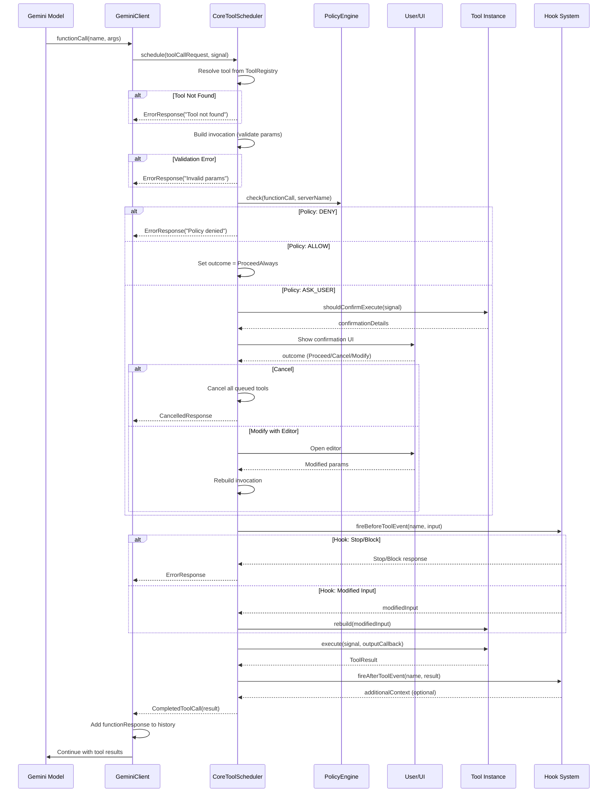
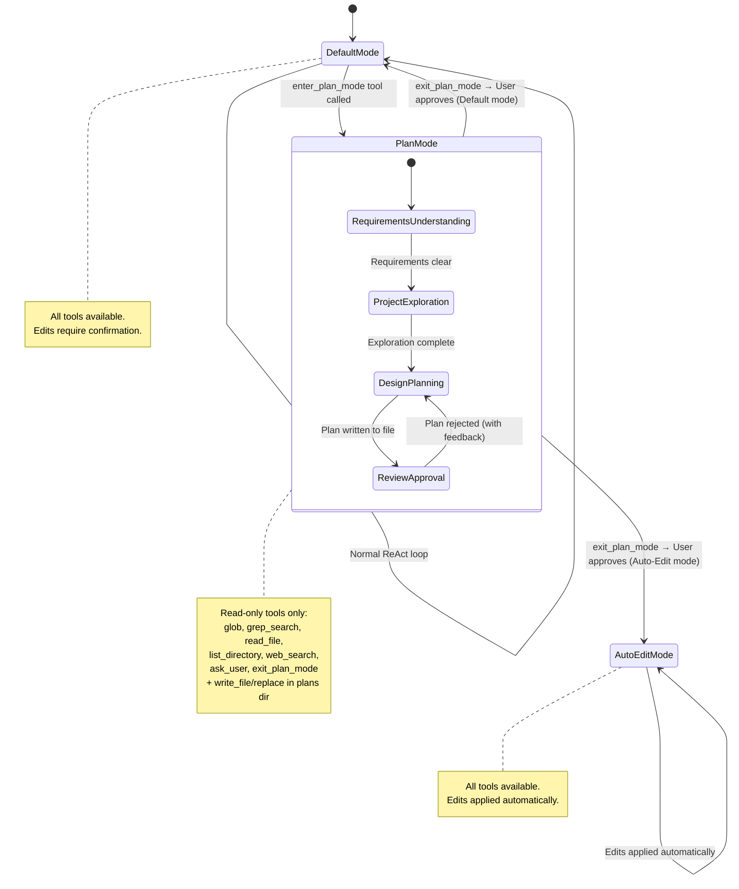
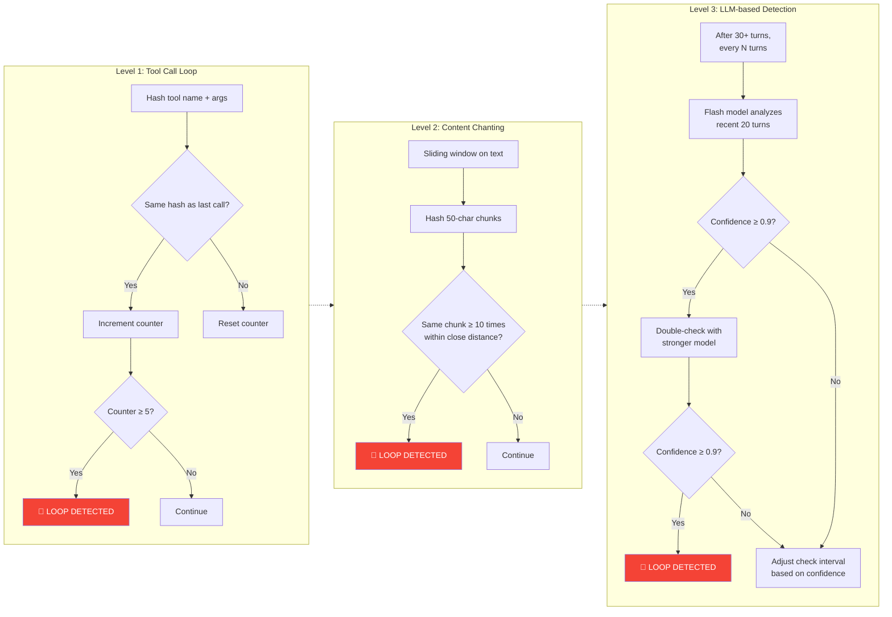
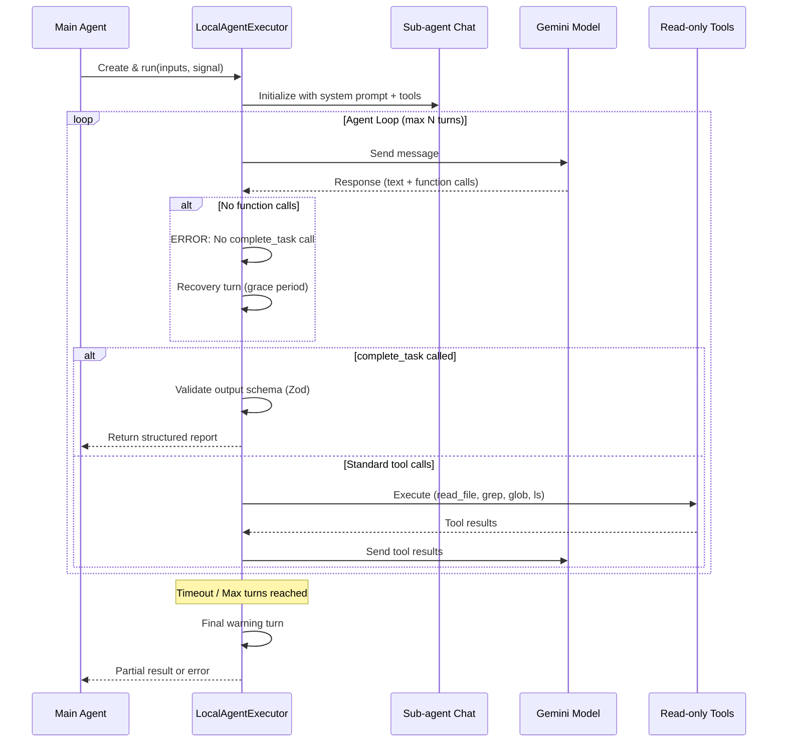

# Gemini CLI — Workflow Logic, Pseudo-code & Diagrams

## 1. Mã giả (Pseudo-code) — Thuật toán Cốt lõi

### 1.1 Main Agent Loop (High-Level)

```
FUNCTION main_agent_loop(user_input, signal):
    prompt_id = generate_unique_id()
    chat = initialize_chat(system_prompt, tools, history)
    turns_remaining = MAX_TURNS  // 100

    // ===== HOOK: BeforeAgent =====
    hook_result = fire_before_agent_hook(user_input, prompt_id)
    IF hook_result.stopped:
        RETURN "Agent execution stopped by hook"
    IF hook_result.blocked:
        YIELD blocked_event
        RETURN
    IF hook_result.additional_context:
        user_input = user_input + hook_result.additional_context

    request = user_input

    WHILE turns_remaining > 0 AND NOT signal.aborted:
        // ===== TURN PROCESSING =====
        turn = process_turn(request, signal, prompt_id, turns_remaining)
        YIELD turn.events  // Stream events to UI

        IF turn.has_error:
            BREAK

        // ===== TOOL CALL HANDLING =====
        IF turn.has_pending_tool_calls:
            tool_results = schedule_and_execute_tools(turn.pending_tool_calls, signal)
            request = build_function_response(tool_results)
            turns_remaining -= 1
            CONTINUE  // Go to next turn with tool results

        // ===== NEXT-SPEAKER CHECK (Reflection) =====
        IF NOT signal.aborted:
            next_speaker = check_next_speaker(chat.history)
            IF next_speaker == "model":
                request = "Please continue."
                turns_remaining -= 1
                CONTINUE
            ELSE:
                BREAK  // Wait for user input

    // ===== HOOK: AfterAgent =====
    hook_result = fire_after_agent_hook(user_input, cumulative_response)
    IF hook_result.stopped:
        YIELD stopped_event
    IF hook_result.blocked:
        YIELD blocked_event
        // May trigger additional turn with feedback

    RETURN turn
```

### 1.2 Process Turn (Single Turn Logic)

```
FUNCTION process_turn(request, signal, prompt_id, turns_remaining):
    session_turn_count += 1

    // Check session-wide turn limit
    IF session_turn_count > MAX_SESSION_TURNS:
        YIELD max_session_turns_event
        RETURN empty_turn

    // ===== CONTEXT WINDOW MANAGEMENT =====
    compressed = try_compress_chat(prompt_id)
    IF compressed.status == COMPRESSED:
        YIELD chat_compressed_event

    // Check for context window overflow
    remaining_tokens = token_limit(model) - last_prompt_token_count
    estimated_request_tokens = calculate_request_token_count(request)
    IF estimated_request_tokens > remaining_tokens:
        YIELD context_window_overflow_event
        RETURN empty_turn

    // ===== IDE CONTEXT (if in IDE mode) =====
    IF ide_mode AND NOT pending_tool_call:
        ide_context = get_ide_context_parts()
        IF ide_context:
            add_to_history(ide_context)

    // ===== LOOP DETECTION =====
    loop_detected = loop_detector.turn_started(signal)
    IF loop_detected:
        YIELD loop_detected_event
        RETURN turn

    // ===== MODEL ROUTING =====
    IF current_sequence_model:
        model = current_sequence_model  // Sticky model within sequence
    ELSE:
        model = router.route(history, request, signal)
    current_sequence_model = model

    // ===== CALL MODEL (via Turn.run) =====
    turn = new Turn(chat, prompt_id)
    response_stream = turn.run(model_config, request, signal)

    FOR EACH event IN response_stream:
        // Real-time loop detection on streaming events
        IF loop_detector.add_and_check(event):
            YIELD loop_detected_event
            ABORT
            RETURN turn

        YIELD event  // Forward to UI

        IF event.type == ERROR:
            RETURN turn

    // ===== HANDLE INVALID STREAM =====
    IF is_invalid_stream AND continue_on_failed_api_call:
        // Recursive retry with "System: Please continue."
        turn = RECURSIVE_CALL process_turn("System: Please continue.", ...)
        RETURN turn

    RETURN turn
```

### 1.3 Tool Scheduling & Execution

```
FUNCTION schedule_and_execute_tools(tool_call_requests, signal):
    completed_calls = []

    FOR EACH request IN tool_call_requests:
        // ===== TOOL RESOLUTION =====
        tool = tool_registry.get_tool(request.name)
        IF NOT tool:
            completed_calls.ADD(error("Tool not found"))
            CONTINUE

        // ===== BUILD INVOCATION =====
        TRY:
            invocation = tool.build(request.args)
        CATCH validation_error:
            completed_calls.ADD(error(validation_error))
            CONTINUE

        // ===== POLICY CHECK =====
        decision = policy_engine.check(tool_call)
        IF decision == DENY:
            completed_calls.ADD(error("Policy denied"))
            CONTINUE

        // ===== CONFIRMATION (if needed) =====
        IF decision == ASK_USER:
            confirmation_details = invocation.should_confirm_execute(signal)
            IF confirmation_details:
                outcome = AWAIT user_confirmation(confirmation_details)
                IF outcome == CANCEL:
                    cancel_all_remaining()
                    RETURN completed_calls
                IF outcome == MODIFY_WITH_EDITOR:
                    modified_params = open_editor(invocation)
                    invocation = tool.build(modified_params)

        // ===== HOOK: BeforeTool =====
        hook_result = fire_before_tool_hook(tool_name, tool_input)
        IF hook_result.stopped OR hook_result.blocked:
            completed_calls.ADD(error(hook_result.reason))
            CONTINUE
        IF hook_result.modified_input:
            invocation = tool.build(hook_result.modified_input)

        // ===== EXECUTE TOOL =====
        TRY:
            result = invocation.execute(signal, live_output_callback)
        CATCH error:
            completed_calls.ADD(error(error))
            CONTINUE

        // ===== HOOK: AfterTool =====
        hook_result = fire_after_tool_hook(tool_name, result)
        IF hook_result.additional_context:
            result.append(hook_result.additional_context)

        completed_calls.ADD(success(result))

    RETURN completed_calls
```

### 1.4 Sub-agent Execution (Local Agent Executor)

```
FUNCTION run_subagent(definition, inputs, signal):
    agent_id = generate_agent_id()
    chat = create_agent_chat(definition.system_prompt, definition.tools)
    turn_counter = 0
    max_turns = definition.max_turns
    timeout = definition.max_time_minutes

    query = template(definition.query, inputs)
    current_message = { role: "user", text: query }

    WHILE true:
        // Check termination conditions
        IF turn_counter >= max_turns:
            BREAK with MAX_TURNS
        IF signal.aborted OR timeout_reached:
            BREAK with TIMEOUT/ABORTED

        // Compress chat if needed
        try_compress_chat(chat, prompt_id)

        // Call model
        { function_calls, text_response } = call_model(chat, current_message, signal)

        // If model stops calling tools without complete_task → error
        IF function_calls.length == 0:
            BREAK with ERROR_NO_COMPLETE_TASK_CALL

        // Process function calls
        FOR EACH call IN function_calls:
            IF call.name == "complete_task":
                validate_output(call.args)
                RETURN { result: call.args.report, status: GOAL }
            ELSE IF call.name NOT IN allowed_tools:
                respond_with_error("Unauthorized tool")
            ELSE:
                execute_tool_via_scheduler(call)

        current_message = { role: "user", parts: tool_responses }
        turn_counter += 1

    // ===== RECOVERY TURN =====
    // Give agent one final chance with grace period
    IF reason IN [TIMEOUT, MAX_TURNS, ERROR_NO_COMPLETE_TASK_CALL]:
        recovery_result = execute_final_warning_turn(chat, reason)
        IF recovery_result:
            RETURN { result: recovery_result, status: GOAL }

    RETURN { result: error_message, status: reason }
```

---

## 2. Sơ đồ quy trình (Diagrams)

### 2.1 Main Agent Loop — Flowchart

```mermaid
flowchart TD
    A[User Input] --> B{BeforeAgent Hook}
    B -->|Stopped| Z1[Return: Stopped by Hook]
    B -->|Blocked| Z2[Return: Blocked by Hook]
    B -->|OK / Additional Context| C[Process Turn]

    C --> D{Check Limits}
    D -->|Max Session Turns| Z3[Yield: MaxSessionTurns]
    D -->|Context Overflow| Z4[Yield: ContextWindowOverflow]
    D -->|OK| E[Compress Chat if Needed]

    E --> F{Loop Detection:<br/>Turn Started}
    F -->|Loop Detected| Z5[Yield: LoopDetected]
    F -->|OK| G[Route to Model]

    G --> H[Model Generates Response<br/>via Turn.run&#40;&#41;]

    H --> I{Parse Response Events}
    I -->|Thought| J[Yield: Thought Event]
    I -->|Content Text| K[Yield: Content Event]
    I -->|Function Call| L[Yield: ToolCallRequest]
    I -->|Error| Z6[Yield: Error Event]
    I -->|Finished| M{Has Pending Tool Calls?}

    J --> I
    K --> I
    L --> I

    M -->|Yes| N[Schedule & Execute Tools<br/>via CoreToolScheduler]
    N --> O[Build Function Response]
    O --> P[Decrement turns_remaining]
    P --> C

    M -->|No| Q{Next-Speaker Check}
    Q -->|model should continue| R["Send 'Please continue.'"]
    R --> C
    Q -->|user should speak| S{AfterAgent Hook}

    S -->|Stopped| Z7[Yield: AgentExecutionStopped]
    S -->|Blocked + Feedback| T["Continue with feedback"]
    T --> C
    S -->|OK| U[Return: Wait for User]

    style A fill:#4CAF50,color:#fff
    style Z1 fill:#f44336,color:#fff
    style Z2 fill:#f44336,color:#fff
    style Z3 fill:#FF9800,color:#fff
    style Z4 fill:#FF9800,color:#fff
    style Z5 fill:#FF9800,color:#fff
    style Z6 fill:#f44336,color:#fff
    style Z7 fill:#f44336,color:#fff
    style U fill:#2196F3,color:#fff
```



### 2.2 Tool Scheduling Pipeline — Sequence Diagram



### 2.3 Plan Mode Workflow — State Diagram



### 2.4 Loop Detection — Multi-Level Architecture



### 2.5 Sub-agent (Codebase Investigator) — Sequence Diagram



### 2.6 Complete System Architecture — Component Diagram

```mermaid
flowchart TB
    subgraph CLI["CLI Layer (packages/cli)"]
        UI[Terminal UI / Ink Components]
        Input[User Input Handler]
        NonInteractive[Non-Interactive CLI]
    end

    subgraph Core["Core Layer (packages/core)"]
        subgraph Client["GeminiClient"]
            SendMsg[sendMessageStream]
            ProcessTurn[processTurn]
            NextSpeaker[checkNextSpeaker]
        end

        subgraph Turn_["Turn"]
            TurnRun[Turn.run - Stream Response]
        end

        subgraph Chat["GeminiChat"]
            ChatStream[sendMessageStream]
            ChatHistory[History Management]
            ChatRecording[ChatRecordingService]
        end

        subgraph Tools_["Tool System"]
            Registry[ToolRegistry]
            BuiltIn["Built-in Tools<br/>(read_file, write_file, shell,<br/>grep, glob, edit, ...)"]
            PlanTools["Plan Mode Tools<br/>(enter_plan_mode, exit_plan_mode)"]
            MCP["MCP Tools"]
            Discovered["Discovered Tools"]
        end

        subgraph Scheduler_["Scheduler System"]
            CoreSched[CoreToolScheduler]
            NewSched[Scheduler]
            Executor[ToolExecutor]
            PolicyEng[PolicyEngine]
        end

        subgraph Agents["Agent System"]
            AgentReg[AgentRegistry]
            LocalExec[LocalAgentExecutor]
            CI["Codebase Investigator"]
            Generalist["Generalist Agent"]
        end

        subgraph Services["Services"]
            LoopDet[LoopDetectionService]
            Compress[ChatCompressionService]
            Masking[ToolOutputMaskingService]
            ModelRouter[ModelRouterService]
            Availability[AvailabilityService]
        end

        subgraph Hooks["Hook System"]
            HookSys[HookSystem]
            BeforeAgent[BeforeAgent Hook]
            AfterAgent[AfterAgent Hook]
            BeforeModel[BeforeModel Hook]
            AfterModel[AfterModel Hook]
            BeforeTool[BeforeTool Hook]
            AfterTool[AfterTool Hook]
        end

        subgraph ContentGen["Content Generation"]
            CG[ContentGenerator Interface]
            GenAI[GoogleGenAI SDK]
            CodeAssist[CodeAssist Generator]
            Logging[LoggingContentGenerator]
        end

        subgraph Prompts["Prompt System"]
            PromptProv[PromptProvider]
            Snippets[Prompt Snippets]
            SysMd["GEMINI.md Context"]
        end
    end

    Input --> SendMsg
    NonInteractive --> SendMsg
    SendMsg --> ProcessTurn
    ProcessTurn --> TurnRun
    TurnRun --> ChatStream
    ChatStream --> CG
    CG --> GenAI

    ProcessTurn --> LoopDet
    ProcessTurn --> NextSpeaker
    ProcessTurn --> Compress
    ProcessTurn --> ModelRouter

    TurnRun -->|ToolCallRequest| CoreSched
    CoreSched --> Registry
    CoreSched --> PolicyEng
    CoreSched --> Executor
    Executor --> BeforeTool
    Executor --> BuiltIn
    Executor --> AfterTool

    SendMsg --> BeforeAgent
    SendMsg --> AfterAgent
    ChatStream --> BeforeModel
    ChatStream --> AfterModel

    Registry --> PlanTools
    Registry --> MCP
    Registry --> Discovered

    AgentReg --> LocalExec
    LocalExec --> CI
    LocalExec --> Generalist

    PromptProv --> Snippets
    PromptProv --> SysMd

    UI --> SendMsg

    style Core fill:#E3F2FD,stroke:#1565C0
    style CLI fill:#E8F5E9,stroke:#2E7D32
    style Client fill:#FFF3E0,stroke:#E65100
    style Tools_ fill:#F3E5F5,stroke:#6A1B9A
    style Scheduler_ fill:#FFEBEE,stroke:#B71C1C
    style Agents fill:#E0F2F1,stroke:#004D40
    style Services fill:#FFF8E1,stroke:#F57F17
    style Hooks fill:#FCE4EC,stroke:#880E4F
```



---

## 3. Luồng Dữ Liệu Chi Tiết

### 3.1 Từ User Input đến Model Response

```
User Input (text/image/file)
    │
    ▼
GeminiClient.sendMessageStream()
    │ ── FireBeforeAgentHook()
    │
    ▼
GeminiClient.processTurn()
    │ ── tryCompressChat()          // Nén lịch sử nếu cần
    │ ── tryMaskToolOutputs()       // Ẩn output cũ
    │ ── getIdeContextParts()       // Inject IDE context
    │ ── loopDetector.turnStarted() // Kiểm tra loop
    │ ── router.route()             // Chọn model
    │
    ▼
Turn.run()
    │
    ▼
GeminiChat.sendMessageStream()
    │ ── FireBeforeModelHook()
    │ ── FireBeforeToolSelectionHook()
    │ ── retryWithBackoff(apiCall)   // Retry logic
    │
    ▼
ContentGenerator.generateContentStream()
    │  (GoogleGenAI SDK hoặc CodeAssist)
    │
    ▼
processStreamResponse()
    │ ── Validate response
    │ ── FireAfterModelHook()
    │ ── Record to ChatRecordingService
    │
    ▼
Turn yields events:
    ├── GeminiEventType.Thought
    ├── GeminiEventType.Content
    ├── GeminiEventType.ToolCallRequest
    ├── GeminiEventType.Finished
    └── GeminiEventType.Error
```

### 3.2 Tool Execution Pipeline

```
ToolCallRequest (from model)
    │
    ▼
CoreToolScheduler.schedule()
    │ ── Resolve tool from ToolRegistry
    │ ── Build invocation (validate params)
    │ ── PolicyEngine.check()
    │     ├── DENY → Error response
    │     ├── ALLOW → Auto-proceed
    │     └── ASK_USER → Show confirmation UI
    │
    ▼
ToolExecutor.execute()
    │ ── executeToolWithHooks()
    │     ├── fireBeforeToolEvent()
    │     ├── invocation.execute(signal)
    │     └── fireAfterToolEvent()
    │
    ▼
CompletedToolCall
    │ ── Record to ChatRecordingService
    │ ── Build functionResponse Part
    │
    ▼
Add to chat history → Next turn
```
